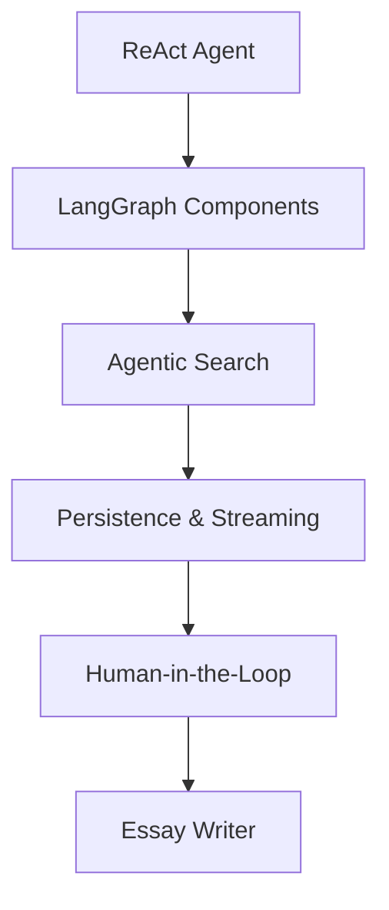

🤖 AI Agents in LangGraph 🚀

A hands-on educational project showing how to build AI agents with LangGraph
.
Step by step, you’ll go from a scratch ReAct agent to advanced topics like persistence, streaming, human-in-the-loop, and creative generation.

🎯 Goal: Make LangGraph concepts practical, reproducible, and easy to showcase for recruiters and technical reviewers.


## 📚 Lessons

> Each notebook is a self-contained tutorial.

| # | Lesson | What you’ll practice | Highlights |
|---:|---|---|---|
| 1 | **Simple ReAct Agent from Scratch** | Thought → Action → Observation → Answer loop | Tiny tools: `calculate`, `average_dog_weight` |
| 2 | **LangGraph Components** | Nodes, edges, state passing | Connect agents to information sources |
| 3 | **Agentic Search** | Agent-driven search & structured querying | Retrieval strategies |
| 4 | **Persistence & Streaming** | Persistent state & memory updates | Real-time streaming UX |
| 5 | **Human-in-the-Loop** | Human feedback & oversight | Mixed-initiative collaboration |
| 6 | **Essay Writer** | Long-form, coherent generation | Knowledge-graph-aware writing |


## 📊 Learning Workflow




⚡ Quick Start
```
git clone https://github.com/gorkenvm/AI-Agents-in-LangGraph.git

cd AI-Agents-in-LangGraph

python -m venv .venv

source .venv/bin/activate   # Windows: .venv\Scripts\activate

pip install -r requirements.txt

Create a .env file in the root:
OPENAI_API_KEY=your_api_key_here
MODEL_NAME=gpt-4o
TEMPERATURE=0

Run notebooks: jupyter lab
```

🛠️ Project Structure

```
AI-Agents-in-LangGraph/
├─ notebooks/          → Step-by-step tutorials
├─ src/                → Reusable code (config, tools, utils)
│  ├─ config.py
│  └─ tools/
│     └─ dog_weights.py
├─ tests/              → Unit tests
├─ reports/            → Figures, summaries
├─ requirements.txt    → Core dependencies
├─ requirements-dev.txt→ Dev/test dependencies
├─ Makefile            → Common commands
└─ README.md
```


🧹 Pre-commit Hooks
```
.pre-commit-config.yaml includes:

black → formatting

ruff → linting

isort → import sorting

nbstripout → cleans notebook outputs

Enable with: pre-commit install
```

📖 Usage
```
Run make run to start Jupyter Lab

Open notebooks in order (Lesson 1 → Lesson 6)

Modify tools, extend pipelines, and experiment 🚀
```
🤝 Contributing

Contributions welcome!
Fork the repo, create a branch, and submit a PR.
If you find a bug, please open an issue
.
